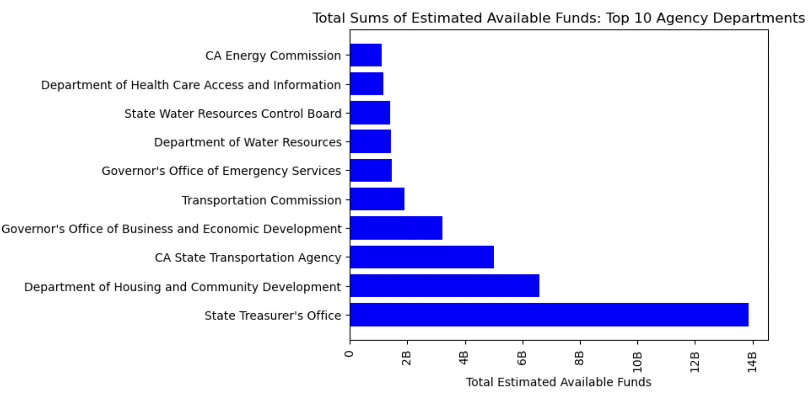

# California-Grants-Data-Analysis

The Grant Information Act of 2018 of California requires the California State Library to build a regularly updating online database for grant opportunities. Grantseekers can glean information on grant or loan opportunities, including information about how to apply. I use Python Pandas in a Jupyter notebook to ask a few questions:   

1. What are the total sums of estimated available funds for projects per agency?  
2. Which agency has the most applications submitted?

I used Matplotlib to create a bar chart of which ten agencies have the most total sums of estimated available funds. I used code directly from Dan Friedman's post at https://dfrieds.com/data-visualizations/how-format-large-tick-values.html to help me format my tick values. 

The public data can be found here: https://catalog.data.gov/dataset/california-grants-portal
